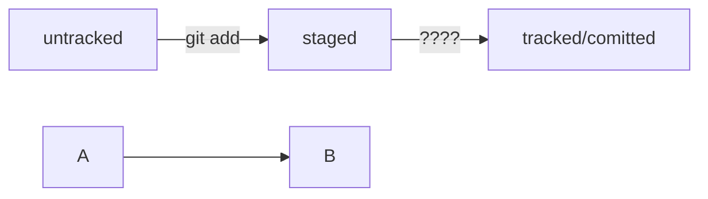

# Practicum Git

## Project for learning git

Hello i'm Roman and i create this project for learning _Git_ **course**

---

in ~~tgis~~ this project i'd like to learn more information about:


- Create Git projects;
- Create README.md;
- Create commits.

---

But it's not last project, i'm front-end developer and next time, i create new, top projects to you see.

# Шпаргалка markdown

## Выделение текста

Вы можете выделять текст в markdown с помощью символов `_` или `*`. Например:

Пример _курсива_ и **жирного** текста.

## Заголовки

Заголовки можно создавать с помощью символа `#`. Чем больше `#`, тем меньше заголовок. Например:

# Заголовок первого уровня
## Заголовок второго уровня
### Заголовок третьего уровня

## Выделение кода

Чтобы выделить текст как код, поместите его в тройные кавычки `````. 

```
mkdir my_project
cd my_project
git init
```
Это лишь некоторые функции markdown.

HEAD -- это голова.
Коммит -- это всему голова.
Статусы файлов:

<тут пустая строка!>

<и тут пустая строка!>



###### Заголовок в конце

---

Вот так вот!

---